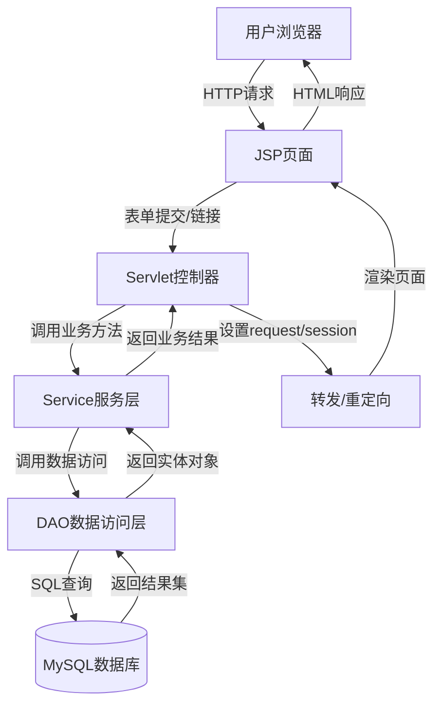
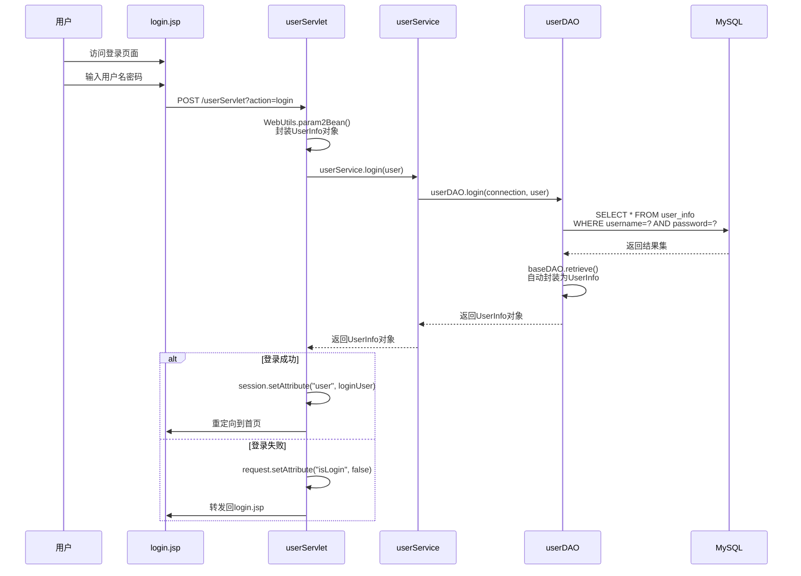
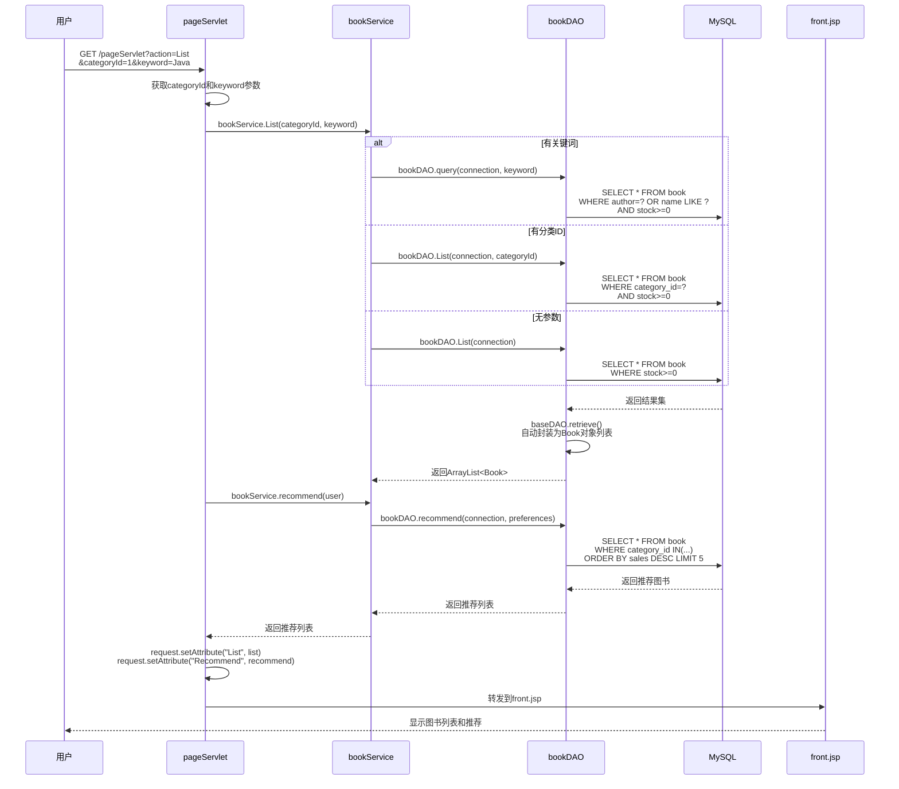
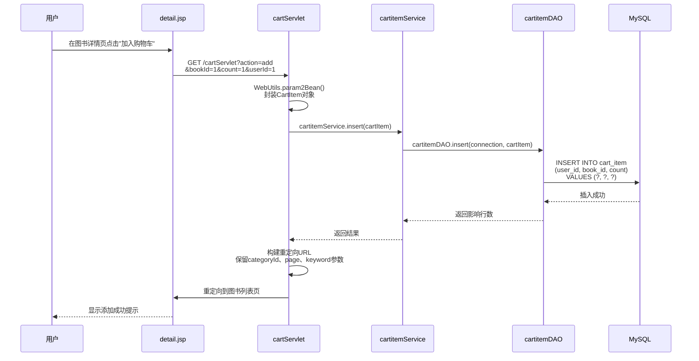
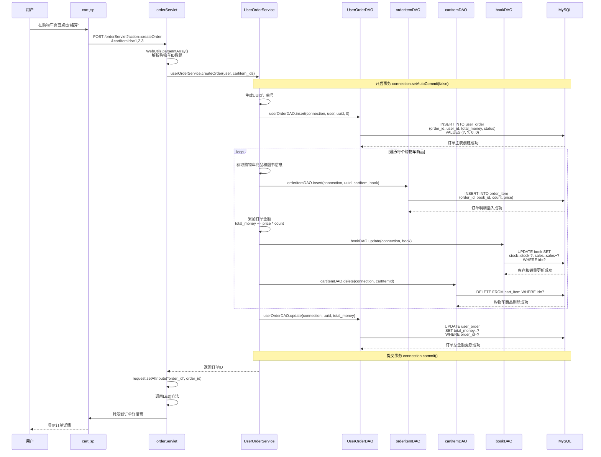
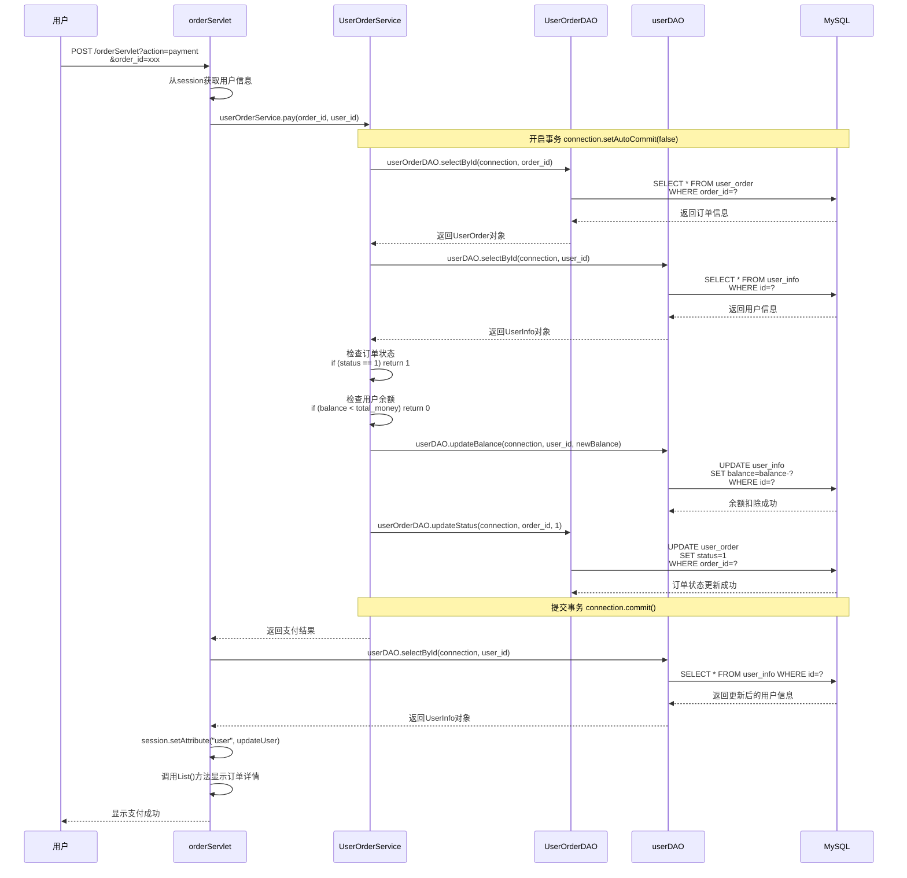
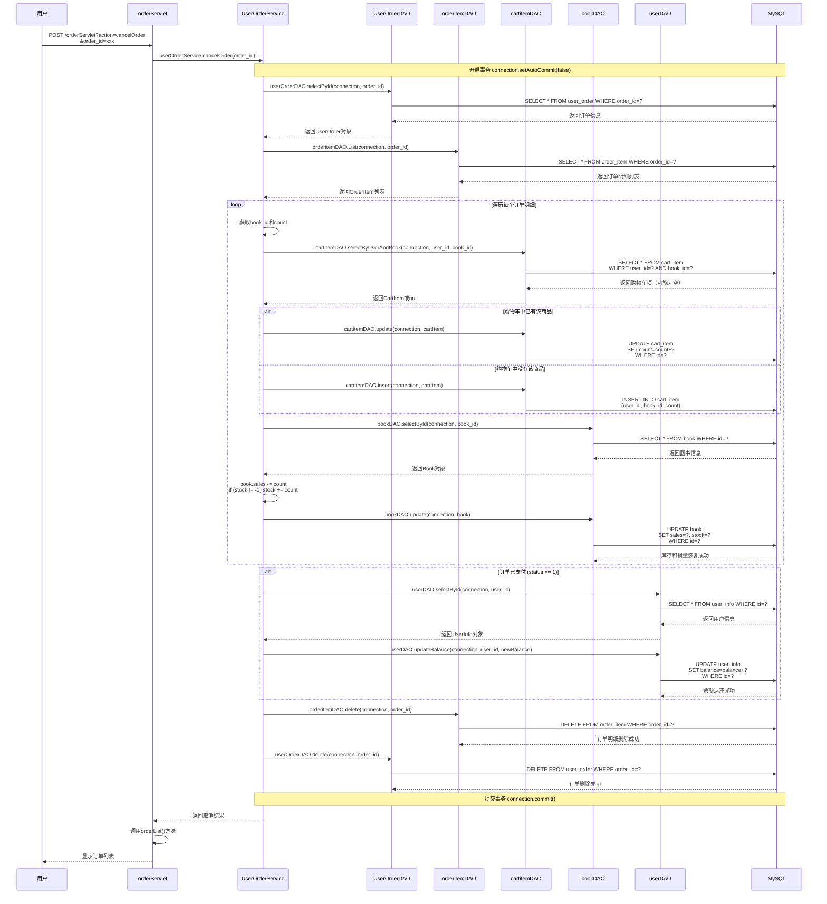
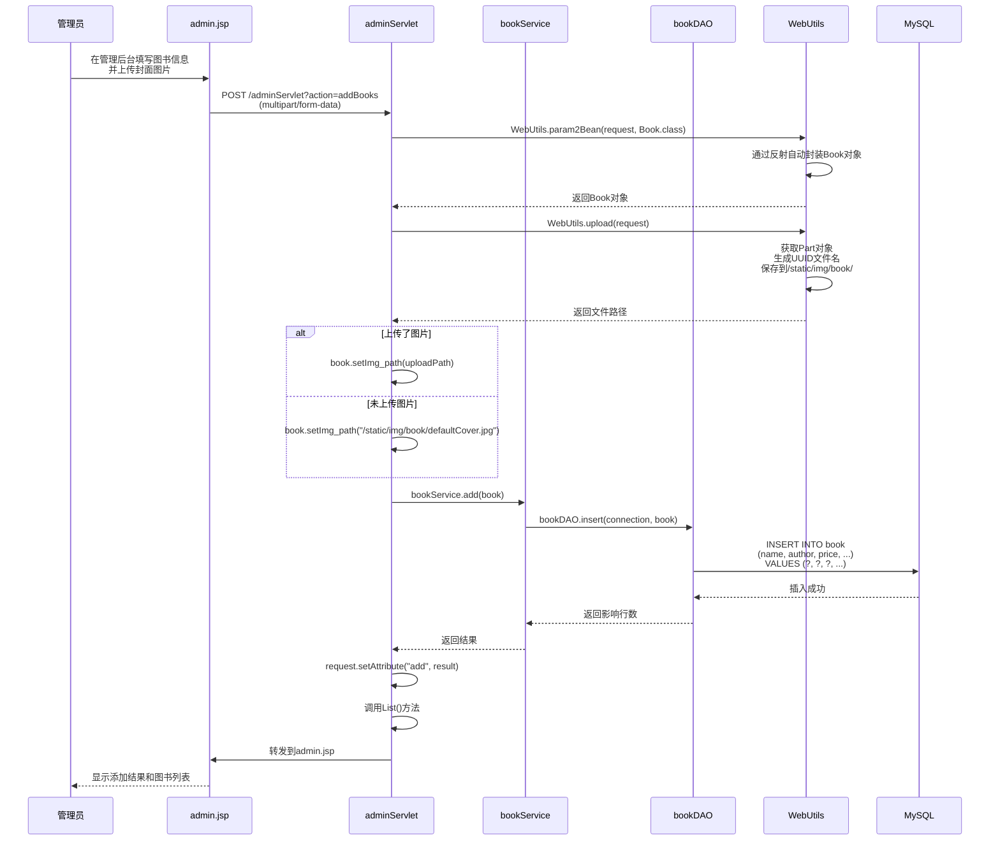
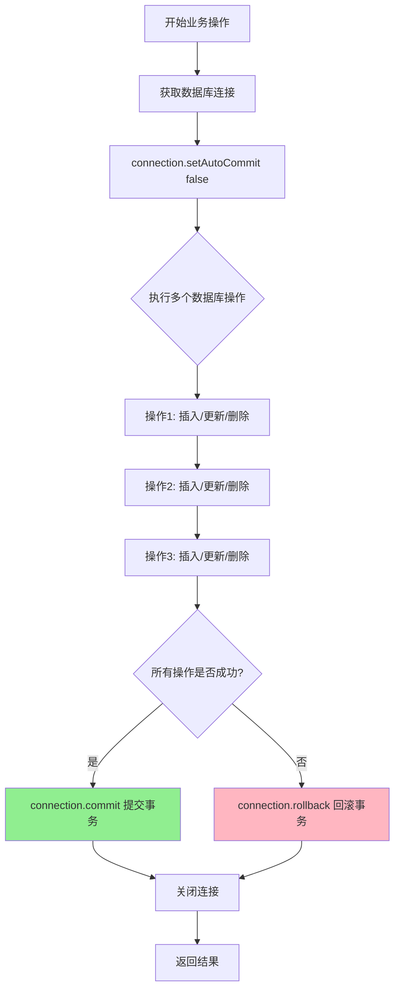

# 书店管理系统 - 数据流程图

## 一、整体架构数据流



## 二、用户登录流程



## 三、图书浏览流程



## 四、购物车添加流程



## 五、订单创建流程（事务处理）



## 六、订单支付流程（事务处理）



## 七、订单取消流程（事务处理）



## 八、管理员添加图书流程



## 九、数据传递路径总结

### 9.1 请求数据流向

```
浏览器请求
    ↓
JSP页面（表单/链接）
    ↓
Servlet控制器（接收request参数）
    ↓
WebUtils工具类（参数封装为Bean）
    ↓
Service服务层（业务逻辑处理）
    ↓
DAO数据访问层（SQL执行）
    ↓
MySQL数据库
```

### 9.2 响应数据流向

```
MySQL数据库（结果集）
    ↓
DAO数据访问层（baseDAO.retrieve()自动封装为Bean）
    ↓
Service服务层（返回业务对象）
    ↓
Servlet控制器（设置request/session属性）
    ↓
JSP页面（EL表达式/JSTL标签渲染）
    ↓
浏览器（HTML响应）
```

### 9.3 数据存储位置

- **request域**：页面间传递的临时数据（转发时有效）
- **session域**：用户会话数据（登录用户信息、购物车状态等）
- **数据库**：持久化数据（用户、图书、订单等）

### 9.4 关键数据传递点

1. **参数封装**：`WebUtils.param2Bean()` - request参数 → JavaBean
2. **结果集映射**：`baseDAO.retrieve()` - ResultSet → JavaBean列表
3. **数据传递**：request.setAttribute() / session.setAttribute()
4. **页面渲染**：JSP EL表达式 ${} 获取数据

---

## 十、事务处理流程图



---

## 总结

本项目的数据传递遵循经典的MVC三层架构模式，通过以下机制实现高效的数据流转：

1. **反射机制**：自动参数封装和结果集映射，减少重复代码
2. **事务管理**：关键业务操作使用事务保证数据一致性
3. **统一入口**：baseServlet通过action参数统一分发请求
4. **通用DAO**：baseDAO通过泛型和反射实现通用数据访问

整个系统的数据流清晰、职责分明，便于维护和扩展。

